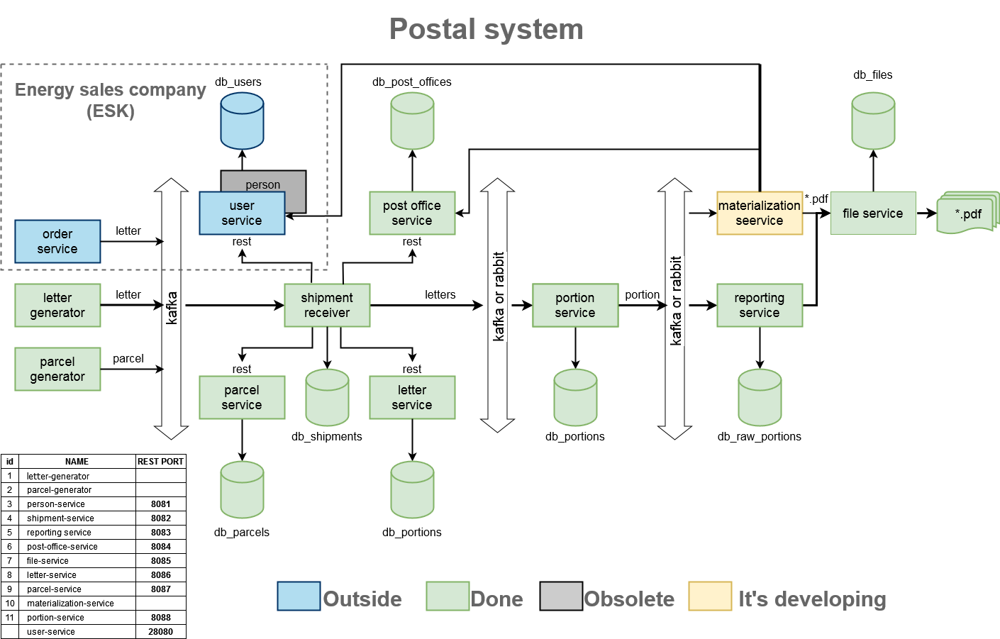

# Postal system (Почтовая система)

 

Почтовая система построена на основе микросервисной архитектуры, она
состоит из 10 микросервисов и стартера.  

Система принимает письма и посылки в виде JSON-сообщений по общей шине,
а затем обрабатывает их и регистрирует в базе данных для дальнейшего ведения
статистики и формирования отчетов. 

Отчеты формируются по заданным фильтрам, результат сохраняется в виде
файла в формате PDF, XML, XLS.  

Почтовая система интегрирована с внешней системой - ”Личным кабинетом
“Энергосбытовая компания" (ESK), из которой она получает входящую информацию
(письма, посылки), а также подтягивает дополнительную информацию для сервисов
Почтовой системы.  

Система использует СУБД PostgreSQL в качестве основной, взаимодействие с
базой осуществляется при помощи технологии Spring JPA.  

Микросервисы взаимодействуют используя REST-запросы и общую шину на
базе Kafka (при этом есть возможность использовать вместо нее RabbitMQ).  

Тестирование производится в контейнерах, что позволяет тестировать
приложения локально пользуясь всеми преимуществами полноценной базы и шины. 

## ИСПОЛЬЗУЕМЫЕ ТЕХНОЛОГИИ 

- Apache Maven
- Java 11, Kotlin
- Spring Boot: core, web, test, data-jpa
- Apache Kafka, RabbitMQ
- Spring-Cloud: OpenFeign
- Testcontainers
- Swagger UI
- Mapstuct
- Jackson
- Lombok
- Checkstyle,  Detekt
- PostgreSQL
- Docker
- Nexus
